  

  

    <b>AI Automation Builder</b> · Junior Full-Stack Developer · Georgia 🇬🇪
  

  

    I turn messy real-world workflows into reliable AI products — 
    call analytics, chatbots, and agentic systems that teams actually use.
  

  

    
    
  

---

### What I build

| Area | Focus |
|------|--------|
| **AI Analytics** | Call-center intelligence — transcription, classification, operator scoring |
| **Chatbots** | Messenger & Instagram bots for real customer conversations |
| **Agentic systems** | RAG pipelines that answer from your own data, not just prompts |
| **Full-stack apps** | React/Node products deployed with Docker, Railway, Supabase |

---

### Tech I use daily

**Languages & runtime**  
`TypeScript` `JavaScript` `Python` `HTML` `CSS` `Node.js`

**Frontend**  
`React` `Next.js` `Tailwind` `Bootstrap` `Figma`

**Backend & data**  
`Express` `NestJS` `Supabase` `MongoDB` `Firebase`

**AI & infra**  
`Gemini` `RAG` `Docker` `Railway` `Linux` `Git` `GitHub`

  

---

### Currently leveling up

- System design for production AI pipelines  
- DevOps: CI/CD, observability, safer deploys  
- Shipping fewer demos — more durable systems  

---

### GitHub

  
  

  

---

  
    Open to collaboration on AI automation, analytics products, and full-stack builds. 
    Best way to reach me → <a href="https://www.linkedin.com/in/giorgi-shalamberidze-2490632aa/">LinkedIn</a>
  

